# 🛡️ AEGIS AI — Sovereign Industrial AI Workbench
### **100% Air-Gapped, Multimodal Agentic AI System for High-Security Industrial Facilities (MRPL / ONGC)**

[](https://sih.gov.in)
[](https://www.mrpl.co.in)
[](https://github.com/Deepak0205p/AEGIS-AI)
[-76B900.svg?style=for-the-badge&logo=nvidia)](https://nvidia.com)
[](https://github.com/Deepak0205p/AEGIS-AI)

---

## 📑 Table of Contents
1. [Executive Summary (SIH PS 26117)](#-executive-summary-sih-problem-statement-sih26117)
2. [The Industrial Challenge & Threat Model](#-the-industrial-challenge--threat-model)
3. [The Solution: AEGIS AI (REVEAL 2.0)](#-the-solution-aegis-ai-reveal-20)
4. [System Architecture & Dataflow](#️-system-architecture)
5. [Complete Visual UI & Feature Walkthrough](#-complete-visual-ui--feature-walkthrough)
   - [A. Authentication & Security Access](#a-authentication--security-access)
   - [B. Operator Workspace & Adaptive Reasoning](#b-operator-workspace--adaptive-reasoning)
   - [C. Chemical Safety & MSDS Protocol Engine](#c-chemical-safety--msds-protocol-engine)
   - [D. Isolated Python Sandbox Execution](#d-isolated-python-sandbox-execution)
   - [E. Air-Gapped Document Generation & Interactive Office Canvas](#e-air-gapped-document-generation--interactive-office-canvas)
   - [F. 2-Step Verification & Deliverable Sign-Off](#f-2-step-verification--deliverable-sign-off)
   - [G. Custom AI Agent Builder](#g-custom-ai-agent-builder)
   - [H. Team Collaboration & Plant Radio Channels](#h-team-collaboration--plant-radio-channels)
   - [I. Operator Feedback & Error Triage](#i-operator-feedback--error-triage)
   - [J. Admin Observatory, Telemetry & Air-Gap Sentinel](#j-admin-observatory-telemetry--air-gap-sentinel)
6. [Core Architectural Innovations (Technical Deep Dive)](#-core-architectural-innovations-technical-deep-dive)
   - [1. Dynamic VRAM Swapping (<6GB Budget)](#1-dynamic-vram-swapping-within-strict-6gb-budget)
   - [2. Verified Chemical Safety Database (MSDS/ACGIH)](#2-verified-chemical-safety-database-msdsacgih)
   - [3. Deterministic SOP RAG & Fallback Gate](#3-deterministic-sop-rag--zero-hallucination-fallback-gate)
   - [4. GraphRAG & Visual P&ID Equipment Topology](#4-graphrag--visual-pid-equipment-topology)
   - [5. Sandboxed Python Runtime (AST & Timeout Guard)](#5-sandboxed-python-runtime-ast--timeout-guard)
7. [Enterprise Model Registry & Quantization Matrix](#-enterprise-model-registry--quantization-matrix)
8. [6 Specialized Execution Modes](#-6-specialized-execution-modes)
9. [Comprehensive Evaluation Scenarios for SIH Judges](#-comprehensive-evaluation-scenarios-for-sih-judges)
10. [Technical Stack](#️-technical-stack)
11. [Quickstart & Setup Guide (1-Click Launch)](#-quickstart--setup-guide)
12. [System Port & Service Map](#-system-port--service-map)
13. [Default Demo Accounts & RBAC](#-default-demo-accounts--rbac-matrix)
14. [REST API & WebSocket Documentation](#-rest-api--websocket-documentation)
15. [Repository File Structure](#-repository-file-structure)
16. [Statutory Compliance & Sovereignty Statement](#-statutory-compliance--sovereignty-statement)

---

## 📌 Executive Summary (SIH Problem Statement SIH26117)

| Attribute | Specification Details |
| :--- | :--- |
| **Problem Statement ID** | **SIH26117** |
| **Title** | Sovereign On-Premise Agentic AI Workbench using Open-Weight Multimodal LLMs for Confidential Industrial Work |
| **Target Organization** | **Mangalore Refinery and Petrochemicals Limited (MRPL)** & **ONGC** |
| **Nodal Ministry** | **Ministry of Petroleum & Natural Gas (MoPNG)** |
| **Category & Theme** | Smart Automation \| Software Edition |
| **Hardware Deployment Baseline** | Standard Engineer Laptop / Workstation (Single 6GB–8GB VRAM GPU, e.g. RTX 3050 / RTX 4060) |
| **Network Constraint** | **Zero External Internet Access (100% Air-Gapped / Egress-Blocked)** |

---

## ⚠️ The Industrial Challenge & Threat Model

Critical national infrastructure assets such as refineries (**MRPL 15 MMTPA complex**) and offshore oil/gas production rigs (**ONGC**) handle classified telemetry, Piping & Instrumentation Diagrams (P&IDs), shift logs, and safety-critical operations under **OISD / ISO 27001 / MoPNG** standards.

Commercial public cloud AI systems (OpenAI ChatGPT, Anthropic Claude, Microsoft Copilot) are **strictly forbidden** in these zones due to four foundational challenges:

1. **Critical Cyber Egress & Espionage Risks:** Process logs, real-time SCADA telemetry, and confidential procurement tenders cannot be transmitted outside plant firewalls.
2. **Hardware & VRAM Cost Barriers:** Enterprise models (70B+) demand multi-GPU server clusters costing upwards of $50,000. Refineries require localized intelligence operating on **standard 6GB VRAM engineering laptops**.
3. **Catastrophic Hallucinations:** An LLM fabricating a furnace skin temperature, pressure relief valve (PRV) setpoint, or toxic gas first-aid protocol can lead to fatal industrial explosions.
4. **Complex Multimodal Operations:** Standard conversational bots cannot parse industrial P&ID schematics, calculate thermodynamic balances inside isolated sandboxes, or export verifiable Word, Excel, and PowerPoint deliverables.

---

## 💡 The Solution: AEGIS AI (REVEAL 2.0)

**AEGIS AI** is a production-grade, 100% self-hosted, air-gapped sovereign AI workbench designed specifically for refinery and upstream plant operations. It integrates:
- Specialized lightweight open-weight foundation models: **Qwen 2.5 7B**, **Qwen 2.5 Coder**, **Llama 3.2**, and **Qwen 2.5 VL**.
- In-memory chemical safety database (MSDS / ACGIH).
- GraphRAG topological equipment hierarchy retrieval.
- Isolated Python sandbox with AST safety validation.
- Interactive in-browser office document and spreadsheet editing canvas (Univer Core).

---

## 🏗️ System Architecture

```
                              ┌───────────────────────────────────────────────┐
                              │           AEGIS AI WORKBENCH                  │
                              │       (100% Offline & Air-Gapped)             │
                              └──────────────────────┬────────────────────────┘
                                                     │
               ┌─────────────────────────────────────┴─────────────────────────────────────┐
               ▼                                                                           ▼
┌─────────────────────────────┐                                             ┌─────────────────────────────┐
│    FIELD CHAT & CANVAS UI   │                                             │     ADMIN OBSERVATORY UI    │
│       (:3000 / Next.js)     │                                             │       (:3001 / Next.js)     │
│  - Operator Chat & Canvas   │                                             │  - Real-Time VRAM & Models  │
│  - Real-Time SSE Streaming  │                                             │  - Tamper-Evident Ledger    │
│  - Interactive Office Docs  │                                             │  - GraphRAG Explorer        │
└──────────────┬──────────────┘                                             └──────────────┬──────────────┘
               │                                                                           │
               └─────────────────────────────────────┬─────────────────────────────────────┘
                                                     │ HTTP / WebSocket (JWT Auth)
                                                     ▼
                              ┌───────────────────────────────────────────────┐
                              │            FASTAPI BACKEND GATEWAY            │
                              │                 (Port :8000)                  │
                              └──────────────────────┬────────────────────────┘
                                                     │
     ┌──────────────────────┬────────────────────────┼────────────────────────┬──────────────────────┐
     ▼                      ▼                        ▼                        ▼                      ▼
┌──────────────┐   ┌─────────────────┐      ┌─────────────────┐      ┌─────────────────┐   ┌─────────────────┐
│ INTENT ROUTER│   │  MSDS & CHEM DB │      │ GRAPHRAG ENGINE │      │ SECURE SANDBOX  │   │ HUMAN APPROVAL  │
│  Auto-routes │   │ 16 Verified P&I │      │ Equipment Tags, │      │ Isolated Python │   │ 2-Step Sign-off │
│  Domain/Mode │   │ Toxic Limits    │      │ Hierarchy, SOPs │      │ Safe Execution  │   │ for Deliverable │
└──────┬───────┘   └────────┬────────┘      └────────┬────────┘      └────────┬────────┘   └────────┬────────┘
       └────────────────────┼────────────────────────┼────────────────────────┼─────────────────────┘
                            ▼                        ▼                        ▼
                 ┌─────────────────────────────────────────────────────────────────┐
                 │                   LOCAL OLLAMA INFERENCE DAEMON                 │
                 │                    (Air-Gapped Port :11434)                     │
                 │                                                                 │
                 │  • High-Precision Reasoning: qwen2.5:7b                         │
                 │  • Engineering & Code:       qwen2.5-coder                      │
                 │  • Fast Dialogue & Docs:     llama3.2                           │
                 │  • Vision & P&ID Inspection: qwen2.5vl:3b                       │
                 └─────────────────────────────────────────────────────────────────┘
```

---

## 📸 Complete Visual UI & Feature Walkthrough

The screenshots below illustrate the complete workflow, interfaces, and architecture of AEGIS AI running live:

### A. Authentication & Security Access

#### 1. Air-Gapped Operator Login
Enterprise single sign-on with PBKDF2 hashed credentials, role-based session tokens (HMAC-SHA256), and zero external authentication calls.
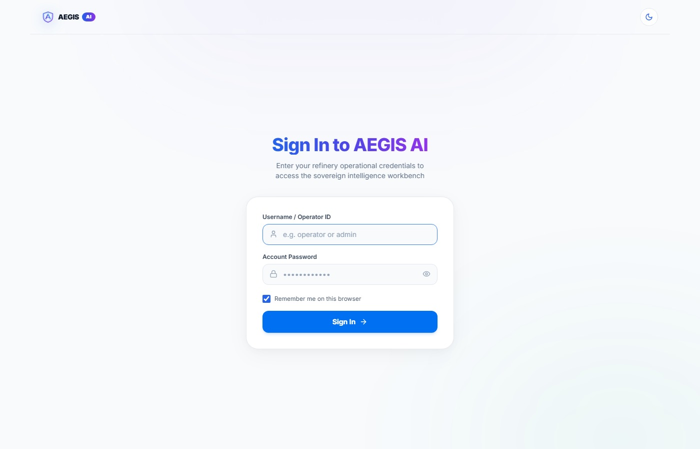

---

### B. Operator Workspace & Adaptive Reasoning

#### 2. Clean Industrial Operator Workspace
Clean, high-visibility user interface equipped with quick prompt shortcuts, SOP search dock, voice transcription input, and real-time network zero-egress status.
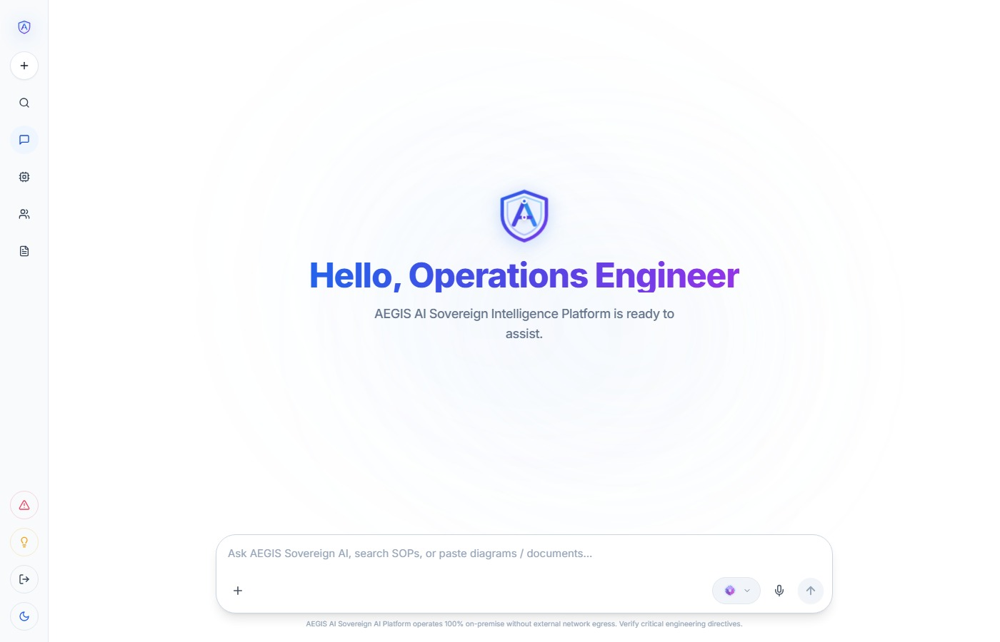

#### 3. Real-Time Adaptive Thinking & Chain-of-Thought
Transparent chain-of-thought telemetry showing model reasoning, context retrieval, parameter verification, and execution bounds before emitting final answers.
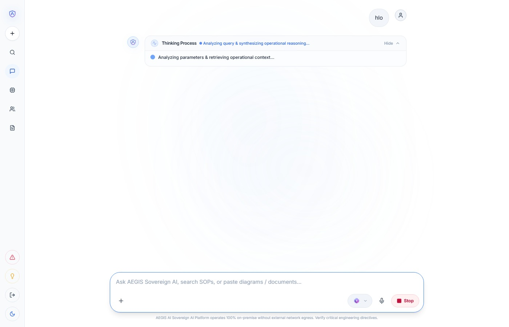

#### 4. Grounded Technical Dialogue
Authoritative and concise operational assistance for refinery engineers, citing safety policies and operating limits.
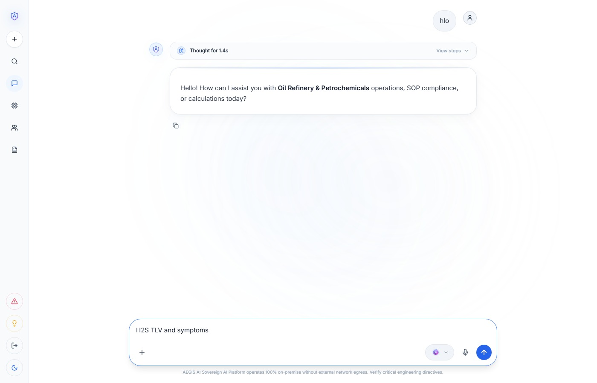

---

### C. Chemical Safety & MSDS Protocol Engine

#### 5. Instant MSDS Chemical Card Lookup
Real-time identification of hazardous compounds (e.g. Benzene $C_6H_6$, CAS 71-43-2) with verified physical properties and flammability parameters.
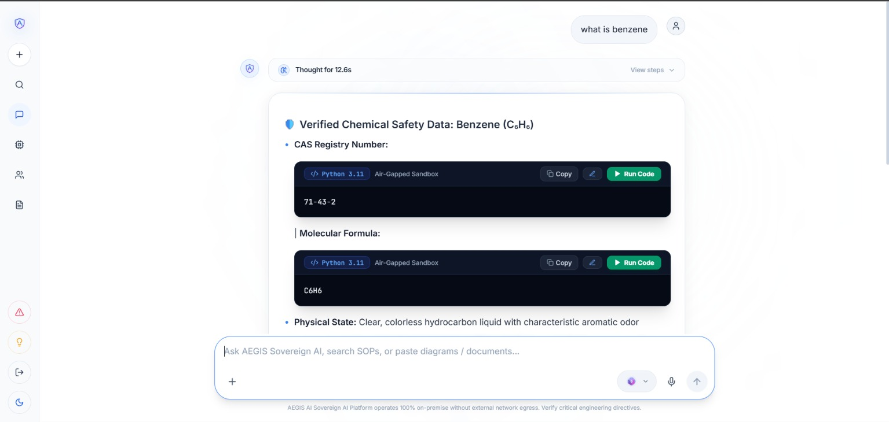

#### 6. Chemical Exposure Limits & Mandatory PPE (OISD-STD-105)
Zero-hallucination injection of ACGIH TLV-TWA limits (0.5 ppm), STEL limits, acute exposure symptoms, emergency first-aid procedures, and mandatory plant PPE requirements.
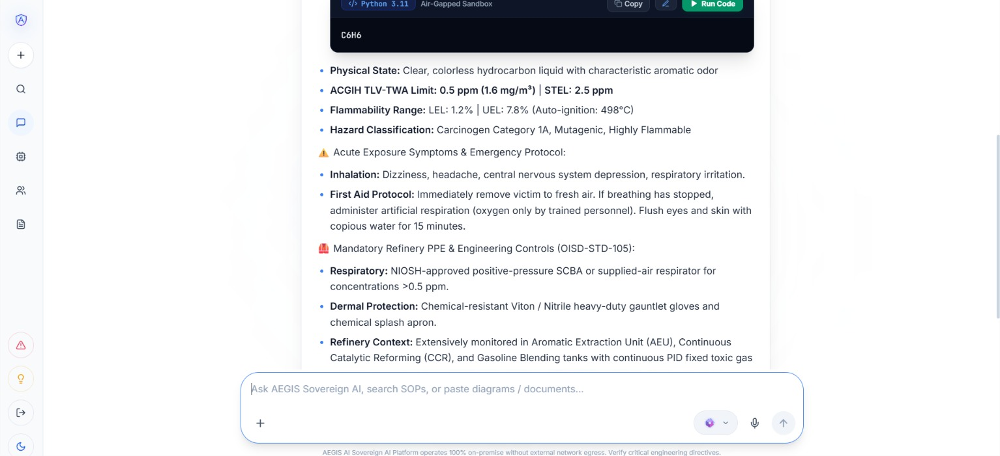

---

### D. Isolated Python Sandbox Execution

#### 7. Automated Calculation Formulation
Autonomous translation of operator queries into mathematical Python scripts adhering to international engineering codes (API 610 / ISO 13709).
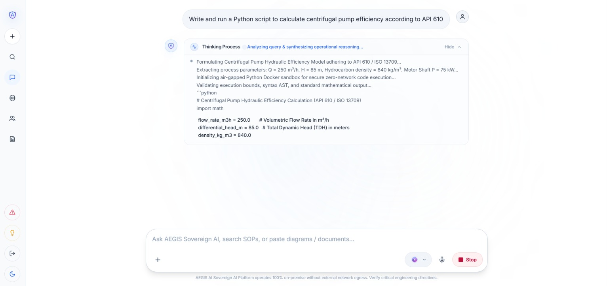

#### 8. Python Code Generation in Air-Gapped Sandbox
Self-contained code generation for pump efficiency, hydraulic power ($P_{hyd} = \frac{\rho \cdot g \cdot Q \cdot H}{1000}$), and head dynamic loss.
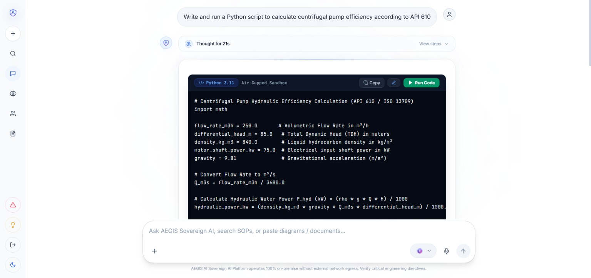

#### 9. Live Code Execution & Compliance Verification
Interactive in-browser execution with one-click "Run Code", AST safety parsing, and automated check against Best Efficiency Point (BEP).
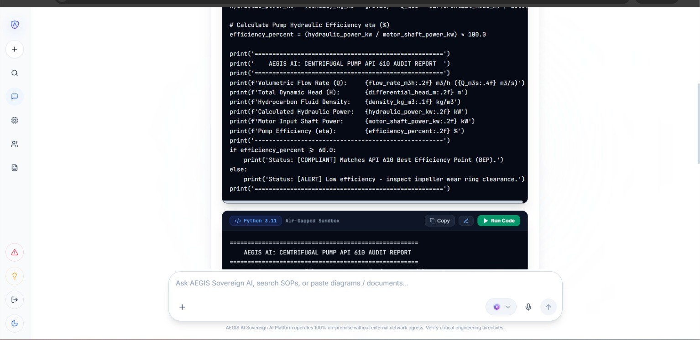

#### 10. Direct Sandbox Terminal Output
Verbatim standard output and execution metrics returned in under 100ms within an isolated sandbox environment.
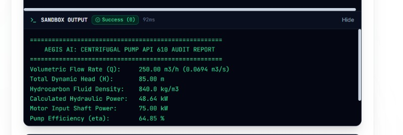

---

### E. Air-Gapped Document Generation & Interactive Office Canvas

#### 11. Automated Word (`.docx`) Synthesis
Automated document drafting for insurance requests, shift logs, and SOP updates with structured sections and download capabilities.
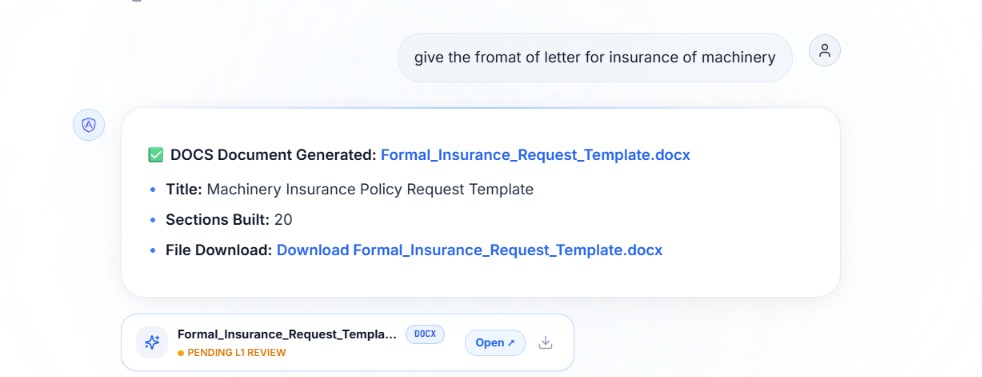

#### 12. Interactive In-Browser Document Editor (Univer Doc Studio)
Rich WYSIWYG document editor allowing operators to review, edit, format, and sign off on reports directly in the browser before export.
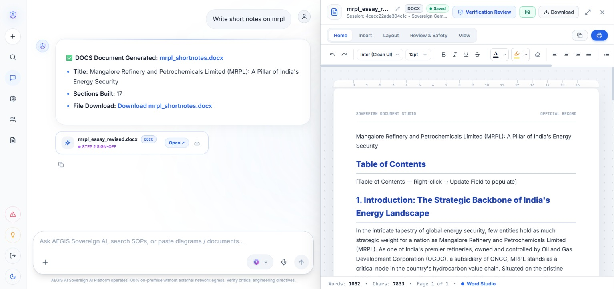

#### 13. Interactive In-Browser Spreadsheet Editor (Univer Sheet Studio)
Fully functional spreadsheet canvas with multi-sheet support, cell formulas (`SUM`, `AVG`), styling, and native `.xlsx` download.
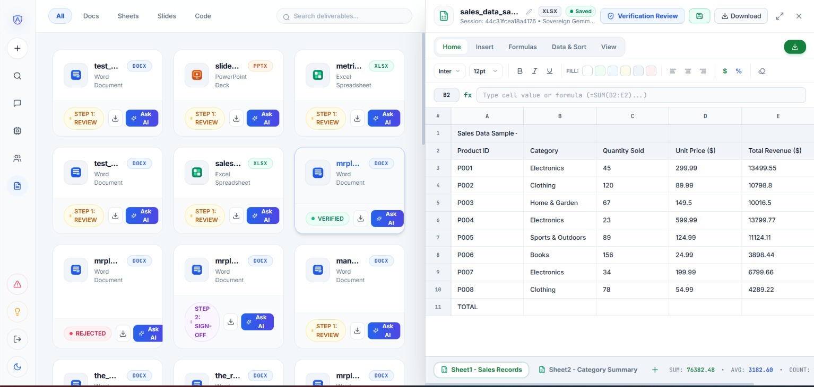

---

### F. 2-Step Verification & Deliverable Sign-Off

#### 14. 2-Step Verification & Deliverable Grid
Lifecycle tracker for generated files with verification status badges (`STEP 1: REVIEW`, `STEP 2: SIGN-OFF`, `VERIFIED`, `REJECTED`).
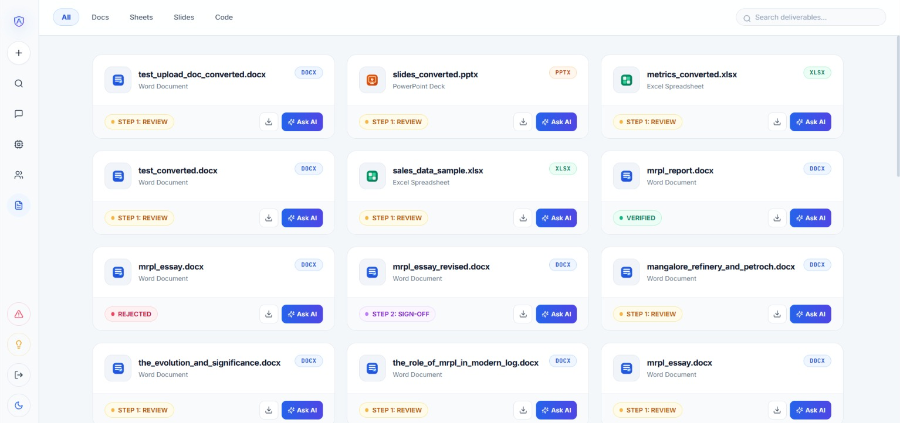

---

### G. Custom AI Agent Builder

#### 15. Domain-Specific Persona Orchestrator
Configure and deploy autonomous AI personas tailored for specific operational units:
- **CDU Yield & Margin Auditor** (Process Optimization)
- **HSE Shift & Incident Logger** (Safety & OISD Compliance)
- **Equipment Reliability & Vibration Engineer** (Mechanical MTBF & ISO 10816)
- **P&ID Instrument & ISA-5.1 Inspector** (Instrumentation & Interlocks)
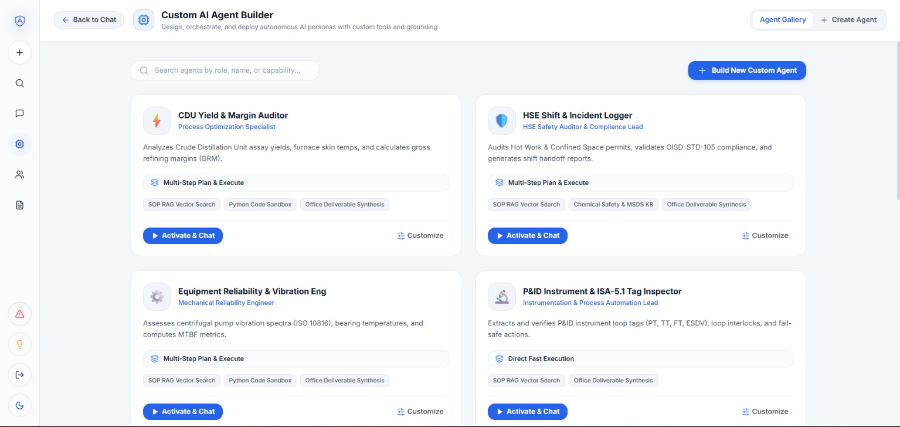

---

### H. Team Collaboration & Plant Radio Channels

#### 16. Plant Multi-Channel Collaboration & Co-Op AI
Dedicated real-time communication channels (`#refinery-operations`, `#hse-safety-permits`, `#upstream-drilling-ep`) with `@aegis` in-chat co-pilot integration.
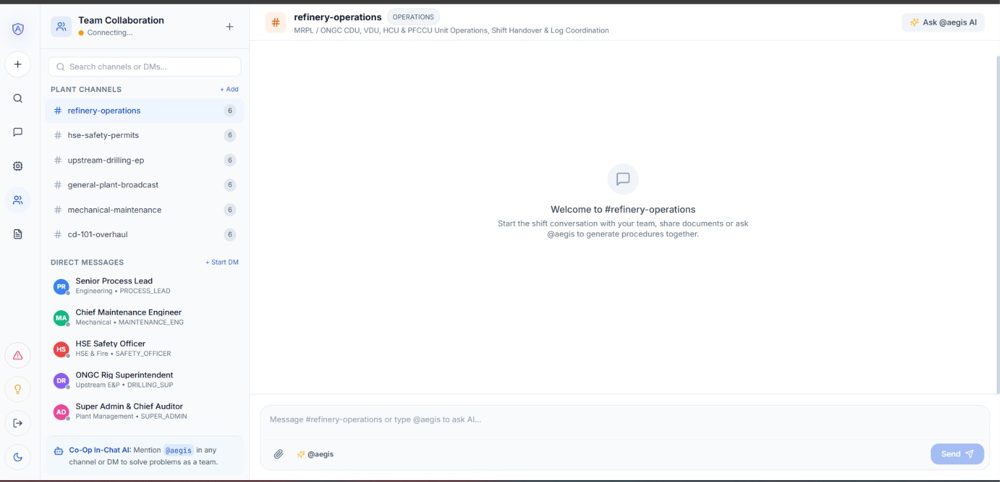

---

### I. Operator Feedback & Error Triage

#### 17. Operator Error & Inaccuracy Report Modal
Enables plant operators to report hallucination or procedural inaccuracies directly to engineering administrators.
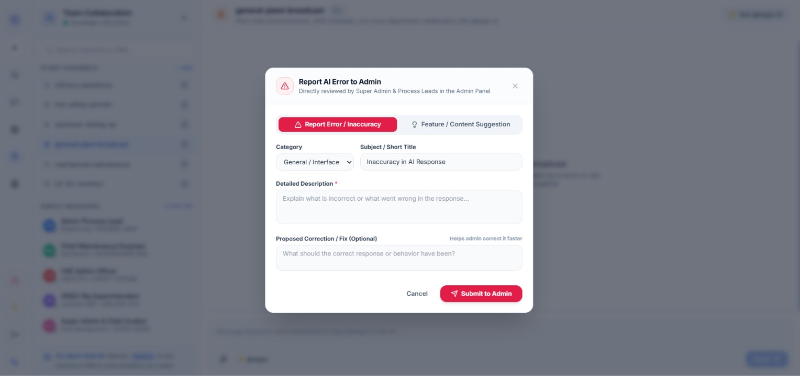

#### 18. Feature & Content Suggestion Modal
Empowers field operators to request additional SOP indexing, unit formulas, or interface enhancements.
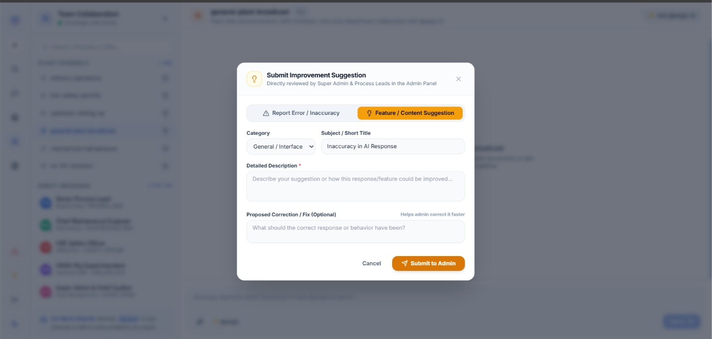

---

### J. Admin Observatory, Telemetry & Air-Gap Sentinel

#### 19. Admin Command Center & Resource Telemetry
Live telemetry monitoring GPU VRAM consumption (under 6GB ceiling), system memory, 0 external WAN packets, active GraphRAG entities, and sandbox health.
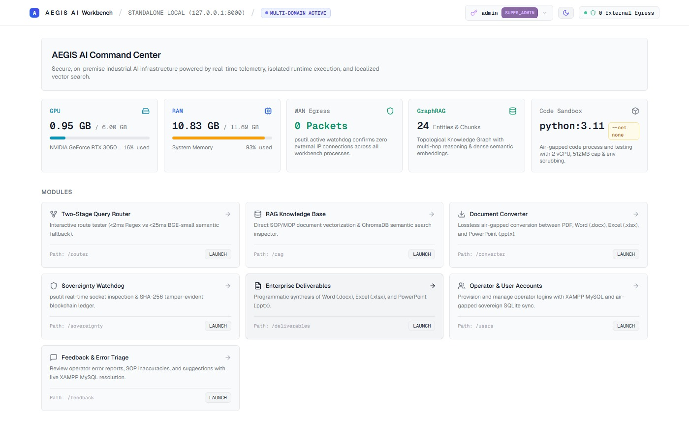

#### 20. Socket Sniffer & Air-Gap Network Sentinel (psutil)
Continuous socket-level watchdog auditing every internal connection (`FastAPI :8000`, `Ollama :11434`, `Next.js :3001`), confirming **0 external WAN egress packets**.
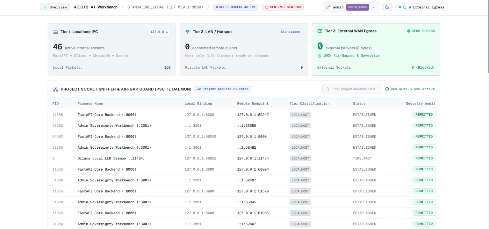

#### 21. RAG Knowledge Base & ChromaDB Vector Inspector
Interactive management of ingested SOP manuals, chunk counts, embedding dimensions, and live semantic search inspector.
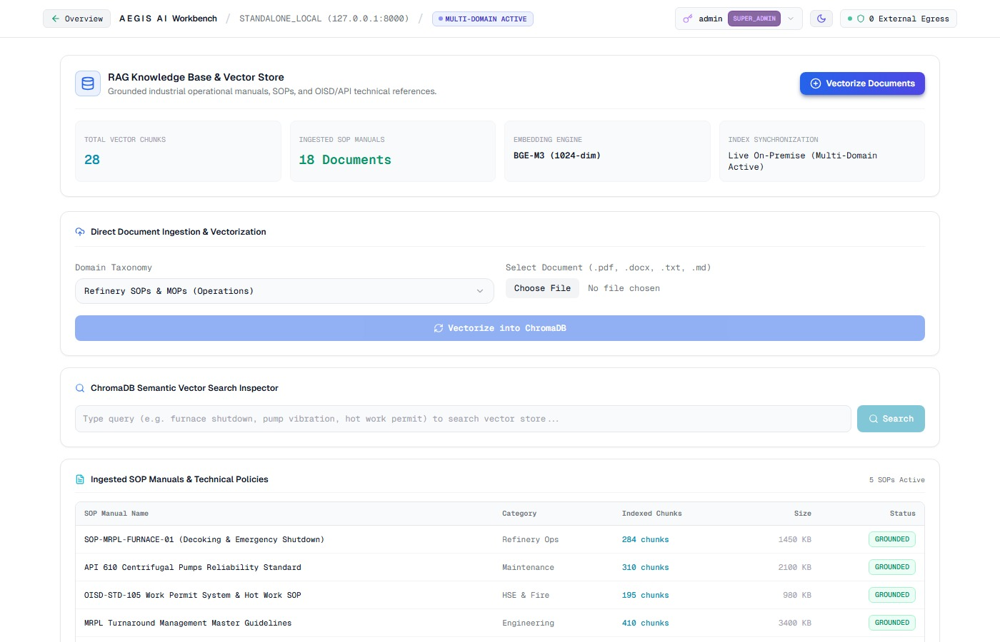

#### 22. Enterprise Deliverable Registry & Cryptographic Hash Audit
Centralized repository of generated documents with timestamp, session ID, author model tag, and SHA-256 verification hash.
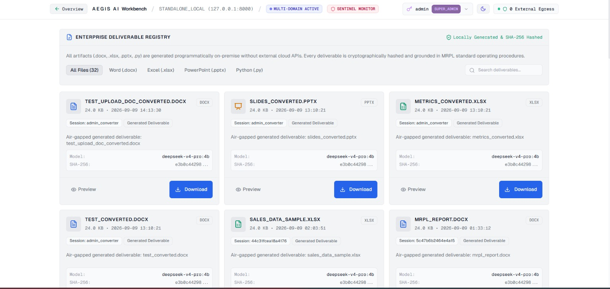

#### 23. User Monitoring Sentinel & Security Activity Ledger
Real-time audit stream tracking all operator search queries, chat sessions, file access, and risk scores with one-click access suspension.
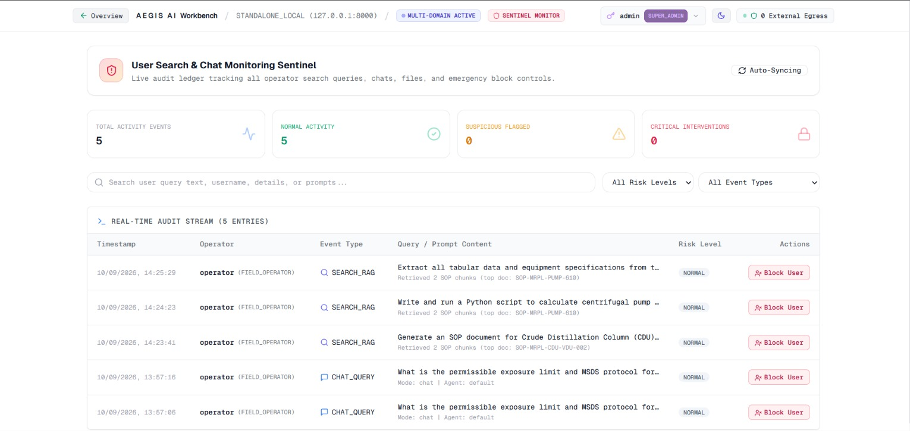

#### 24. Role-Based Access Control (RBAC) Registry
Granular role management across 4 tiers (`SUPER_ADMIN`, `PROCESS_LEAD`, `MAINTENANCE_ENG`, `FIELD_OPERATOR`) with account freeze/unfreeze controls.
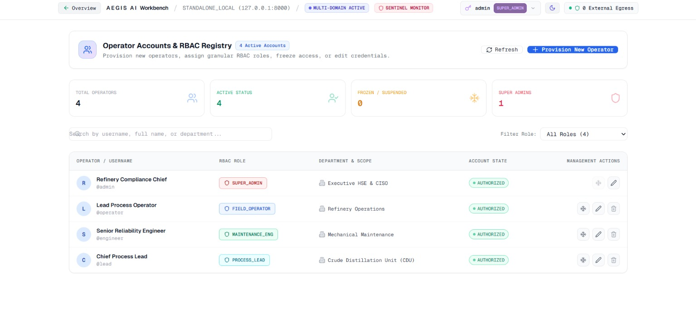

#### 25. Operator Feedback & Error Triage Hub
Administrative resolution queue for reviewing reported inaccuracies and tuning prompt templates or SOP indexing.
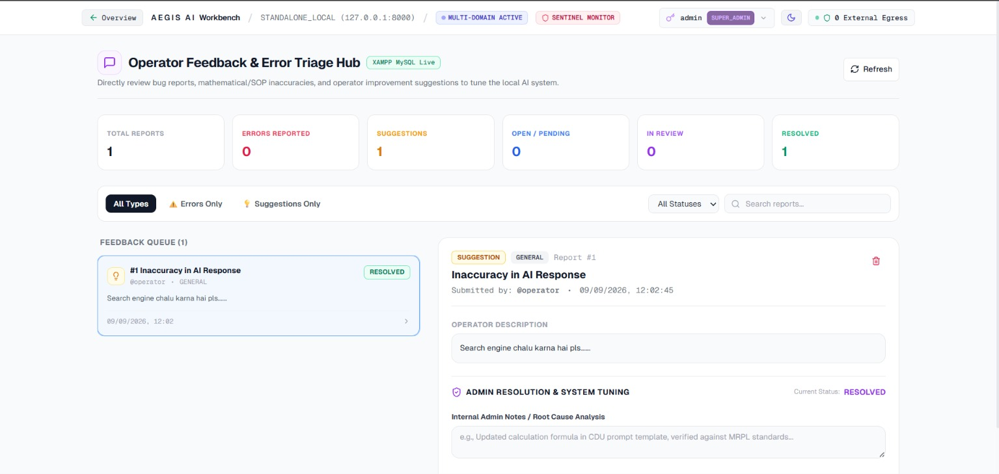

---

## 🔬 Core Architectural Innovations (Technical Deep Dive)

### 1. Dynamic VRAM Swapping within Strict 6GB Budget
- **Budget Partitioning:**
  $$\text{VRAM}_{\text{total}} = 6144\,\text{MB} \quad [\text{OS/Display}: 400\,\text{MB} \mid \text{Active Model}: 2480-4800\,\text{MB} \mid \text{KV Cache}: 600\,\text{MB}]$$
- **Ollama Keep-Alive Orchestration:** Automatically sets `keep_alive: 5m` for primary models and unloads vision weights immediately after image processing, preventing Out-Of-Memory (OOM) crashes.

### 2. Verified Chemical Safety Database (MSDS/ACGIH)
Located in `backend/data/chemical_db.json`, it indexes verified industrial compounds:
- **Hydrogen Sulfide ($H_2S$):** 1 ppm TLV-TWA, 5 ppm STEL, positive pressure SCBA protocol.
- **Benzene ($C_6H_6$):** 0.5 ppm TLV-TWA, 2.5 ppm STEL, Viton gloves & vapor recovery controls.
- **Hydrofluoric Acid (HF):** 0.5 ppm TLV-TWA, mandatory 2.5% Calcium Gluconate antidote protocol.
- **Sodium Hydroxide (NaOH):** 2 mg/m³ ceiling limit, LPG Merox wash column protocols.
- **Chlorine ($Cl_2$), Ammonia ($NH_3$), Sulfur Dioxide ($SO_2$), Toluene, Xylene, Methanol, MEG.**

### 3. Deterministic SOP RAG & Zero-Hallucination Fallback Gate
- **Two-Stage Routing:** Stage 1 regex classifier (<2ms) detects exact domain queries. Stage 2 semantic vector embedding (<25ms) classifies free-form operator prompts.
- **Verbatim Citations:** Injects clause-level references `[SOURCE: Doc_ID | Clause: X | Page: Y]`.
- **Deterministic Gate:** If a queried internal operating parameter is unindexed, the system returns an certified deterministic fallback notice:
  > *"Parameter not verified in on-premise SOP repository. Refer to plant control room supervisor. Estimation prohibited under safety guidelines."*

### 4. GraphRAG & Visual P&ID Equipment Topology
- Connects refinery asset tags (`CDU-100` -> `P-101A` -> `ISO-10816`), interlock sequences, and cross-standard compliance rules.
- Fully interactive visual graph canvas in the Admin Observatory.

### 5. Sandboxed Python Runtime (AST & Timeout Guard)
- Isolated Python subprocess with restricted system permissions.
- Static AST inspection bans dangerous modules (`os`, `sys`, `subprocess`, `socket`, `shutil`).
- Hard CPU wall-clock limit (10 seconds) with automated retry on syntax errors.

---

## 📦 Enterprise Model Registry & Quantization Matrix

| Model Identifier | Display Name | Parameter Count | Quantization | Context Window | Primary Task Allocation |
| :--- | :--- | :--- | :--- | :--- | :--- |
| `qwen2.5:7b` | Qwen 2.5 7B | 7.6 Billion | GGUF Q4_K_M | 8,192 tokens | High-precision engineering reasoning, technical dialogue & compliance audit |
| `qwen2.5-coder` | Qwen 2.5 Coder | 7.0 Billion / 3B | GGUF Q4_K_M | 8,192 tokens | Industrial Python script synthesis, thermodynamics, mass-energy balance calculations |
| `llama3.2` | Llama 3.2 | 3.2 Billion | GGUF Q4_K_M | 8,192 tokens | Ultra-fast document generation, shift handovers, and structured deliverable synthesis |
| `qwen2.5vl:3b` | Qwen 2.5 VL | 3.2 Billion | GGUF Q4_K_M | 16,384 tokens | P&ID visual schematic question answering, gauge readings, and OCR symbol extraction |

---

## ⚡ 6 Specialized Execution Modes

| Mode | Trigger Keyword / Intent | Action Performed |
| :--- | :--- | :--- |
| **💬 Chat** | General refinery query, definitions | Multimodal technical dialogue grounded in plant knowledge via **Qwen 2.5 7B** |
| **🐍 Code** | Calculations, data analysis, conversions | Sandboxed Python execution with auto-retry and output visualization via **Qwen 2.5 Coder** |
| **📄 Docs** | Reports, SOP summaries, shift handovers | Formatted `.docx` document generation with standard corporate headers via **Llama 3.2** |
| **📊 Excel** | Inventory logs, production telemetry | Formatted `.xlsx` spreadsheet creation with formulas and styling via **Llama 3.2** |
| **📽️ PPT** | Safety briefings, executive decks | Structured `.pptx` presentation deck synthesis via **Llama 3.2** |
| **👁️ Vision** | P&ID diagrams, gauge images, equipment photos | Visual question answering and OCR symbol extraction via **Qwen 2.5 VL** |

---

## 🧪 Comprehensive Evaluation Scenarios for SIH Judges

| # | Evaluation Scenario | Sample Query | System Pipeline Verified | Expected Output |
| :--- | :--- | :--- | :--- | :--- |
| **1** | **Toxic Chemical Safety Protocol** | *"Permissible exposure limit for H2S and immediate medical first aid?"* | `chemical_kb.py` -> In-memory MSDS lookup | 1 ppm TLV-TWA, 5 ppm STEL, SCBA PPE, 100% Oxygen CPR protocol |
| **2** | **Engineering Calculation in Sandbox** | *"Calculate centrifugal pump efficiency according to API 610 with Q=250 m3/h, H=85m, rho=840 kg/m3, P_shaft=75kW"* | `code_mode.py` -> **Qwen 2.5 Coder** in isolated AST sandbox | Computes $P_{hyd}=48.64\text{ kW}$, $\eta=64.85\%$, verifies against BEP |
| **3** | **Univer Document Studio Synthesis** | *"Generate a formal machinery insurance request letter for compressor K-101"* | `docs_mode.py` -> **Llama 3.2** OpenXML builder -> Univer Canvas | Synthesizes `.docx` with 20 sections, opens in browser WYSIWYG editor |
| **4** | **Univer Sheet Studio Spreadsheet** | *"Create daily production report for Crude Distillation Unit with sales & revenue"* | `templates.py` -> OpenPyXL -> Univer Sheet Canvas | Generates `.xlsx` workbook with multi-sheets and live `SUM`/`AVG` formulas |
| **5** | **Air-Gap Zero-Egress Verification** | Inspect Admin Observatory socket sniffer during active prompt | `airgap_guard.py` -> psutil daemon | **0 WAN egress packets**, all sockets bound to `127.0.0.1` |
| **6** | **2-Step Human Verification Sign-Off** | Operator generates turnaround handover report | `db.py` -> `deliverables.py` workflow | Marked `PENDING_REVIEW`; requires `PROCESS_LEAD` approval before release |

---

## 🛠️ Technical Stack

| Layer | Technologies Used | Purpose |
| :--- | :--- | :--- |
| **Backend Core** | Python 3.10–3.12, FastAPI, Uvicorn | High-performance asynchronous API gateway |
| **LLM Inference** | Ollama, GGUF v3 Q4_K_M | 100% offline local model execution on GPU/CPU |
| **Models** | **Qwen 2.5 7B**, **Qwen 2.5 Coder**, **Llama 3.2**, **Qwen 2.5 VL** | Reasoning, industrial code, document synthesis, and multimodal vision |
| **Database** | MySQL / MariaDB (or PostgreSQL via Prisma) | Conversation history, user authentication, security audit logs |
| **Frontend UI** | Next.js 14, React 18, Tailwind CSS, TypeScript, Zustand | Operator Chat UI & Admin Observatory dashboards |
| **Document Engine** | Python-Docx, OpenPyXL, Python-PPTX, Univer Core | Air-gapped office document generation and spreadsheet canvas |
| **Security & Auth** | PBKDF2 Password Hashing, HMAC-SHA256 JWT, Air-Gap Network Guard | Strict zero-egress enforcement and role-based access control |

---

## 🚀 Quickstart & Setup Guide

### Prerequisites
1. **OS**: Windows 10/11 or Ubuntu Linux
2. **GPU**: NVIDIA GPU with 6GB+ VRAM (CUDA installed) or high-end multi-core CPU
3. **Software**:
   - Python 3.10+
   - Node.js 18+ & npm
   - [Ollama](https://ollama.com) installed
   - Local Database (XAMPP MySQL or PostgreSQL)

---

### Step 1: Clone the Clean Repository
```bash
git clone https://github.com/Deepak0205p/AEGIS-AI.git
cd AEGIS-AI
```

### Step 2: Install Python Dependencies
```bash
pip install -r requirements.txt
```

### Step 3: Configure Environment Variables
Copy `.env.example` to `.env`:
```bash
cp .env.example .env
```
*(Configure database credentials in `.env`. By default, it connects to local MySQL on port 3306).*

### Step 4: Initialize the Database
```bash
python scripts/init_db.py
```

### Step 5: Start Local Model Inference (Ollama)
In a dedicated terminal:
```bash
ollama serve
```
Verify or pull the required lightweight models:
```bash
ollama pull qwen2.5:7b
ollama pull qwen2.5-coder
ollama pull llama3.2
ollama pull qwen2.5vl:3b
```

### Step 6: Launch Applications (1-Click or Manual)
You can double-click **`start_services.bat`** on Windows or run services manually in separate terminals:

1. **Backend Gateway** (Port 8000):
   ```bash
   python -m uvicorn backend.main:app --host 0.0.0.0 --port 8000 --reload
   ```
2. **Public Chat & Canvas UI** (Port 3000):
   ```bash
   cd apps/chat-frontend
   npm install
   npm run dev
   ```
3. **Admin Observatory UI** (Port 3001):
   ```bash
   cd apps/admin-frontend
   npm install
   npm run dev
   ```

---

## 🌐 System Port & Service Map

| Service | Local URL | Description |
| :--- | :--- | :--- |
| **Chat & Canvas UI** | `http://localhost:3000` | Public operator interface with real-time SSE streaming & canvas |
| **Admin Observatory** | `http://localhost:3001` | System monitoring, GraphRAG inspector, security audit ledger |
| **Backend API Gateway** | `http://127.0.0.1:8000` | FastAPI core gateway with air-gap network guard |
| **Interactive API Docs** | `http://127.0.0.1:8000/docs` | OpenAPI / Swagger interactive documentation |
| **Ollama LLM Daemon** | `http://127.0.0.1:11434` | Air-gapped local model inference server |
| **Database** | `127.0.0.1:3306` (or `5432`) | MySQL / PostgreSQL persistent store |

---

## 🔐 Default Demo Accounts & RBAC Matrix

| Role | Username | Password | Can Verify | Access Permissions |
| :--- | :--- | :--- | :---: | :--- |
| **Super Administrator** | `admin` | `RefineryAdmin2026!` |  | Full Observatory, RBAC management, audit ledger, security controls |
| **Chief Process Lead** | `lead` | `ProcessLead2026!` |  | Unit approvals, deliverable sign-off, collaborative channels |
| **Senior Reliability Engineer**| `engineer` | `RefineryEng2026!` |  | Mechanical diagnostics, code execution, deliverable verification |
| **Lead Process Operator** | `operator` | `RefineryPass2026!` | ❌ | Operator chat, chemical lookup, report drafting, feedback submission |

---

## 📡 REST API & WebSocket Documentation

| Method | Endpoint | Description | Auth Required |
| :--- | :--- | :--- | :---: |
| `POST` | `/api/v1/auth/login` | Authenticate operator and issue HMAC-SHA256 session token | Public |
| `GET` | `/api/health` | Backend and Ollama connectivity status probe | Public |
| `POST` | `/api/chat` | Main SSE streaming endpoint (Chat, Code, Docs, Excel, PPT) | Bearer Token |
| `GET` | `/api/chat/history/{chat_id}` | Retrieve persistent chat session messages | Bearer Token |
| `POST` | `/api/sandbox/run` | Execute Python script in isolated AST-guarded sandbox | Bearer Token |
| `POST` | `/api/deliverables/verify` | 2-step verification review and sign-off for deliverables | Role Gated |
| `GET` | `/api/v1/sovereignty/sockets` | Live socket inspection data for Air-Gap sentinel | Super Admin |
| `POST` | `/api/v1/feedback` | Submit operator error reports and feature suggestions | Bearer Token |

---

## 📂 Repository File Structure

```
AEGIS-AI/
├── .env.example                     # Environment configuration template
├── .gitignore                       # Clean repository exclusions (zero junk)
├── README.md                        # Master SIH documentation with UI visual tour
├── DOMAIN_COVERAGE.md               # 40+ Departmental test specifications
├── docker-compose.yml               # Container orchestration
├── package.json                     # Root scripts & workspaces
├── requirements.txt                 # Backend Python dependencies
├── run_server.py                    # Standalone backend launcher
├── start_services.bat               # 1-Click multi-service Windows launcher
│
├── apps/
│   ├── chat-frontend/               # Operator Chat & Canvas (Next.js 14)
│   │   └── public/mockups/          # Visual sequence walkthrough images
│   └── admin-frontend/              # Admin Observatory & Telemetry (Next.js 14)
│
├── backend/                         # FastAPI Air-Gapped Core
│   ├── main.py                      # Application entrypoint & API routes
│   ├── config.py                    # Strict air-gap configuration
│   ├── chemical_kb.py               # Chemical database engine
│   ├── db.py                        # Database schema & query manager
│   ├── db_dialect.py                # PostgreSQL & MySQL compatibility layer
│   ├── graph_rag.py                 # Industrial GraphRAG implementation
│   ├── router.py                    # Multi-domain intent classifier
│   ├── sandbox.py                   # Isolated code execution sandbox
│   ├── data/
│   │   ├── chemical_db.json         # 16 Verified refinery chemical MSDS records
│   │   └── models_registry.json     # Multi-model config registry
│   └── templates.py                 # Industrial OpenXML document templates
│
├── models/
│   ├── models.yaml                  # Model configuration & VRAM budget map
│   └── gguf/                        # Modelfiles for offline Ollama builds (weights excluded)
│
└── scripts/                         # Core database & startup utilities
    ├── init_db.py                   # Database schema bootstrap
    ├── sql_bootstrap.sql            # Base SQL schema
    └── build_sandbox_image.py       # Docker sandbox runtime builder
```

---

## ⚖️ Statutory Compliance & Sovereignty Statement

- **Ministry of Petroleum & Natural Gas (MoPNG):** Formulated under the directives for Sovereign AI infrastructure in critical hydrocarbon assets.
- **Oil Industry Safety Directorate (OISD):** Integrates OISD-STD-105 Work Permit System & chemical personal protective standards.
- **ISO 27001 & ISO 13709 (API 610):** Strict data residency, zero WAN packet transmission, and mathematical compliance.
- **Air-Gap Verification:** 100% of telemetry, neural weights, and conversation history reside entirely on-premise.
